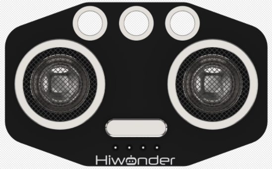

# 1. Ultrasonic Sensor Description

## 1.1 Ultrasonic Sensor Description

### 1.1.1 Sensor Introduction

This is a ultrasonic distance measurement module that uses an ultrasonic distance measurement chip. The chip integrates the ultrasonic transmission circuit, reception circuit, and digital processing circuit.

This module is versatile and primarily used for implementing automatic obstacle avoidance functions in smart cars and intelligent robots.

### 1.1.2 Working Principle

This module uses I/O trigger ranging. The principle is that the module sends an 8-cycle 40 kHz square wave after receiving a 10 μs high-level signal from the control pin, then detects whether a signal is returned. If a return signal is detected, the module outputs a high-level signal whose duration corresponds to the time taken for the ultrasonic wave to travel to the obstacle and back. The propagation speed of the square wave is the same as that of sound, which is 346 m/s. In other words, it takes 28.9 μs for the wave to travel 1 cm.

The specific formula is:  **Measured distance (cm) = High-level time (μs) / 58 (μs/cm)**

## 1.2 Notice

1.  Do not exceed the rated voltage range during use.

2.  Do not use materials that transmit visible light or infrared light as test objects.

3.  Avoid strong light exposure and do not block the light on the test object during use.

4.  Do not operate the sensor in humid environments.

## 1.3 Specifications

For more information of this chip, you may refer to **"[Chip Manual and Schematic](https://drive.google.com/drive/folders/1zSdCBHlWDgSxRzMkXllGtzpwCcnVgjfh?usp=sharing)."**

### 1.3.1 Pin Instruction

| Pin |     Instruction      |
|:---:| :------------------: |
|  +  |     Power Input      |
|  -  |        Ground        |
|  t  | Trigger Signal Input |
|  e  |  Echo signal output  |

### 1.3.2 Specifications

<table class="docutils-nobg" border="1">
<colgroup>
<col style="width: 50%" />
<col style="width: 50%" />
</colgroup>
<tbody>
<tr>
<td colspan="2" style="text-align: center;">
<strong>Ultrasonic Sensor</strong>
</td>
</tr>
<tr>
<td style="text-align: center;">
<strong>Parameter</strong>
</td>
<td style="text-align: center;">
<strong>Specification</strong>
</td>
</tr>
<tr>
<td style="text-align: center;">
<strong>Working Voltage</strong>
</td>
<td style="text-align: center;">
<strong>DC 5V</strong>
</td>
</tr>
<tr>
<td style="text-align: center;">
<strong>Operating Current</strong>
</td>
<td style="text-align: center;">
<strong>15mA</strong>
</td>
</tr>
<tr>
<td style="text-align: center;">
<strong>Operating Frequency</strong>
</td>
<td style="text-align: center;">
<strong>40kHz</strong>
</td>
</tr>
<tr>
<td style="text-align: center;">
<strong>Effective Measurement Range</strong>
</td>
<td style="text-align: center;">
<strong>2Cm - 400cm</strong>
</td>
</tr>
<tr>
<td style="text-align: center;">
<strong>Measurement Angle</strong>
</td>
<td style="text-align: center;">
<strong>15°</strong>
</td>
</tr>
<tr>
<td style="text-align: center;">
<strong>Input Trigger Signal</strong>
</td>
<td style="text-align: center;">
<strong>10 μs TTL pulse</strong>
</td>
</tr>
<tr>
<td style="text-align: center;">
<strong>Output Echo Signal</strong>
</td>
<td style="text-align: center;">
<strong>TTL level signal proportional to the distance</strong>
</td>
</tr>
<tr>
<td style="text-align: center;">
<strong>Connector Type</strong>
</td>
<td style="text-align: center;">
<strong>4-pin header with 2.54 mm pitch</strong>
</td>
</tr>
</tbody>
</table>

## 1.4 Project Outcome

You can refer to the case tutorials and programs for different platforms in the same directory as this tutorial. This section will demonstrate the testing effect using Arduino IDE as an example.

The monitor displays the distance of the ultrasonic wave from the obstacle ahead in centimeters(cm).