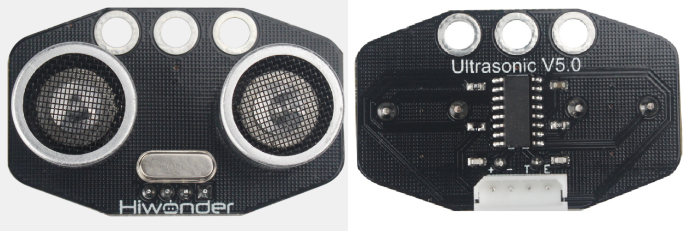
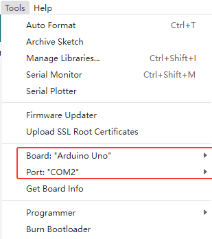
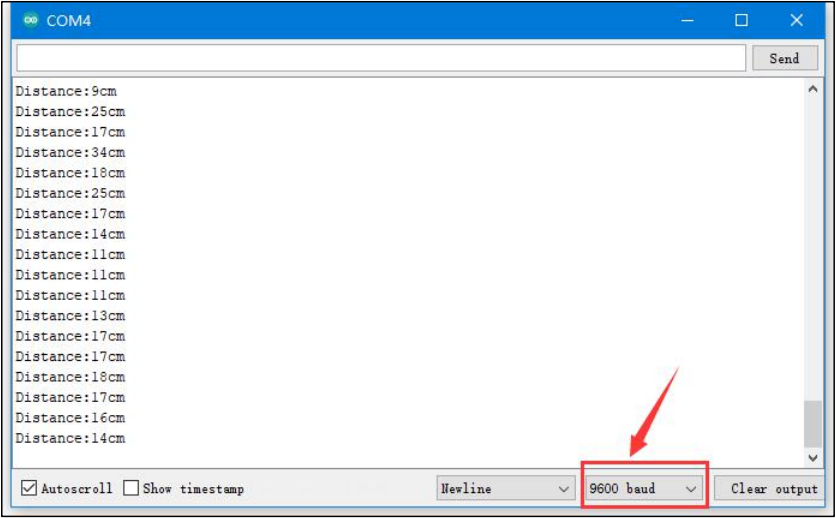

# 2. Arduino Development Tutorial



# 2.1 Getting Started

### 2.1.1 Wiring Instruction

This section illustrates connecting a 4-pin cable to the A4 and A5 ports on the Arduino board. Refer to the diagram below.


> [!NOTE]
>
> **Note:**
>
> * **When using Hiwonder's lithium battery, connect the battery cable with the red wire to the positive (+) terminal and the black wire to the negative (–) terminal of the DC port.**
>
> * **Before connecting the battery cables, make sure they are not already attached to the lithium battery. This prevents the risk of a short circuit caused by accidental contact between the positive and negative wires.**
>
> * **Before powering on, ensure that no metal objects are touching the controller. Otherwise, the exposed pins at the bottom of the board may cause a short circuit and damage the controller.**

### 2.1.2 Environment Configuration

You can install the Arduino IDE on a PC. Download path: **[2 Software Tools & Programs Collection → 01 Software Installation Packages → Arduino Installation Package](https://drive.google.com/drive/folders/1Vd672u6I5hrTk2zL5LPEnUBpEx_Ch5mv?usp=sharing)** For detailed instructions on using the Arduino IDE, refer to the materials in the same directory.

## 2.2 Test Case

In this case, ultrasonic sensor is used to detect distance, and the specific value is displayed through the terminal window.

### 2.2.1 Program Download

1. Connect the Arduino UNO board with the expansion board to the computer via a USB cable. Open Arduino IDE, click "**File → New**," and import the program located in the same directory as this tutorial.

2. Remember to select the correct development board and port (the ports below are for reference only) to compile and upload the program.



3. After the code is uploaded, click  to open the serial monitor, set the baud rate to 9600 to observe the output.

### 2.2.2 Project Outcome

The serial monitor displays the distance of the ultrasonic wave from the obstacle ahead in centimeters(cm).



### 2.2.3 Program Brief Analysis

- **Initialization**

```c++
int inputPin=4; // define ultrasonic signal receiver pin ECHO to D4 
int outputPin=5; // define ultrasonic signal transmitter pin TRIG to D5
 void setup()
{
Serial.begin(9600); 
pinMode(inputPin, INPUT); 
pinMode(outputPin, OUTPUT);
}
```

Initialize the interfaces by connecting the ECHO and TRIG pins of the ultrasonic sensor to D4 and D5 respectively.

Initialize the serial port, set D4 as input mode, and D5 as output mode.

- **Loop Process**

```c++
void loop()
{
digitalWrite(outputPin, LOW); 
delayMicroseconds(2);
digitalWrite(outputPin, HIGH); // Trigger ultrasonic detection with a 10 μs pulse.
delayMicroseconds(10); 
digitalWrite(outputPin, LOW);
int distance = pulseIn(inputPin, HIGH); // Read the pulse duration from the receiver. 
distance= distance/58; // Convert the pulse duration into distance.
Serial.print("Distance:"); 
Serial.print(distance); //Output  data
Serial.println("cm"); 
delay(50);
}
```

Trigger ultrasonic detection and output the processed data to the terminal window.