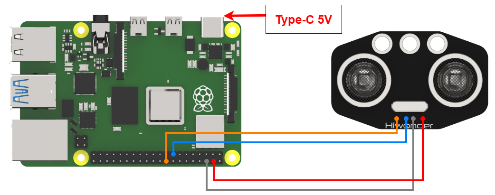
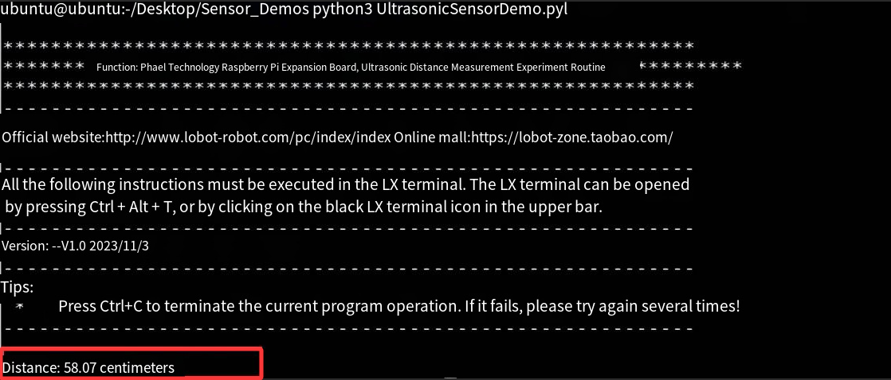

# 3. Raspberry Pi Development Tutorial


## 3.1 Getting Started

### 3.1.1 Wiring Instruction

When wiring, connect the ultrasonic module's positive and negative terminals to the Raspberry Pi's corresponding power pins. Connect the TRIG pin to GPIO22 and the ECHO pin to GPIO24.



> [!NOTE]
>
> **Note:**
>
> * **When using Hiwonder's lithium battery, connect the battery cable with the red wire to the positive (+) terminal and the black wire to the negative (–) terminal of the DC port.**
>
> * **Before connecting the battery cables, make sure they are not already attached to the lithium battery. This prevents the risk of a short circuit caused by accidental contact between the positive and negative wires.**
>
> * **Before powering on, ensure that no metal objects are touching the controller. Otherwise, the exposed pins at the bottom of the board may cause a short circuit and damage the controller.**

### 3.1.2 Environment Configuration

Install NoMachine on your computer. The software package is located under "**[2 Software Tools & Programs -\> 01 Software Installation Package -\> Remote Desktop Connection Tool -\> 1 Remote Desktop Connection Tool](https://drive.google.com/drive/folders/1fPT8Rv4550TR0b_A6XEgt4Kk10eDRgGg?usp=sharing)"**. For detailed usage of NoMachine, refer to the materials in the same directory.

Drag the program and SDK library files into the Raspberry Pi system image, in this example, the files are placed on the Desktop for demonstration. 

> [!NOTE]
>
> **Make sure the library files are placed in the same directory as the program.**

Open the terminal and enter the command to change to the program directory: 

```bash
sudo chmod a+x Sensor_Demo/
```

## 3.2 Test Case

This example displays the status of the ultrasonic sensor detection in the Raspberry Pi terminal window.

### 3.2.1 Program Download

1. Open the terminal and enter the following command to navigate to the program directory:

```bash
cd Desktop/Sensor_Demo/
```

2. Run the program by entering:

```bash
python3 UltrasonicSersorDemo.py
```

### 3.2.2 Project Outcome

Place obstacles at different distances in front of the ultrasonic sensor. The terminal will display the distances detected by the ultrasonic sensor.



### 3.2.3 Program Brief Analysis

- **Import Libraries**

```py
import RPi.GPIO as GPIO
import time
```

Import Raspberry Pi's GPIO library files and time library.

- **Initialization Operation**

```py
# Set GPIO pin numbers (设置GPIO针脚编号)
TRIG = 22
ECHO = 24

# Set GPIO mode to BCM (设置GPIO模式为BCM)
GPIO.setmode(GPIO.BCM)

# Set TRIG pin as output, ECHO pin as input (设置TRIG针脚为输出, ECHO针脚为输入)
GPIO.setup(TRIG, GPIO.OUT)
GPIO.setup(ECHO, GPIO.IN)

def distance_measurement():
    # Send ultrasonic pulse (发送超声波脉冲)
    GPIO.output(TRIG, True)
    time.sleep(0.00002)
    GPIO.output(TRIG, False)
```

Set the corresponding GPIO pins, define the mode, and print the current status.

`TRIG = 22`: Set the TRIG pin number to 22.

`ECHO = 24`: Set the ECHO pin number to 24.

`GPIO.setmode(GPIO.BCM)`: Set the GPIO mode to BCM (Broadcom SOC channel numbering).

`GPIO.setup(TRIG, GPIO.OUT)`: Configure the TRIG pin as an output.

`GPIO.setup(ECHO, GPIO.IN)`: Configure the ECHO pin as an input.

- **Emit Ultrasonic Pulse**

```py
def distance_measurement():
    # Send ultrasonic pulse (发送超声波脉冲)
    GPIO.output(TRIG, True)
    time.sleep(0.00002)
    GPIO.output(TRIG, False)

    start_time = time.time()
    stop_time = time.time()

     # Record the time of ultrasonic emission and reception (记录超声波发射和接收的时间)
    while GPIO.input(ECHO) == 0:
        start_time = time.time()

    while GPIO.input(ECHO) == 1:
        stop_time = time.time()
```

To emit an ultrasonic pulse, set the TRIG pin to high level, wait for a short period, and then set it back to low level. Record the time of sending and receiving the ultrasonic wave using variables. When the ECHO pin receives the reflected signal, stop the timing.

- **Calculate Distance**

```py
# Calculate distance (计算距离)
    elapsed_time = stop_time - start_time
    distance = (elapsed_time * 34300) / 2   # 34300 is the speed of sound, unit is cm/s (34300为声速，单位是厘米/秒)
```

Calculate the round-trip time of the ultrasonic wave using the function, and multiply it by half the speed of sound (34300 cm/s) to obtain the distance.

- **Print data**

```py
try:
    while True:
        dist = distance_measurement()
        print(f"Disdance: {dist:.2f}centimeter")
        time.sleep(0.1)

except KeyboardInterrupt:
    GPIO.cleanup()
```

Call the distance_measurement function to obtain the measured distance, then print the value with two decimal places.